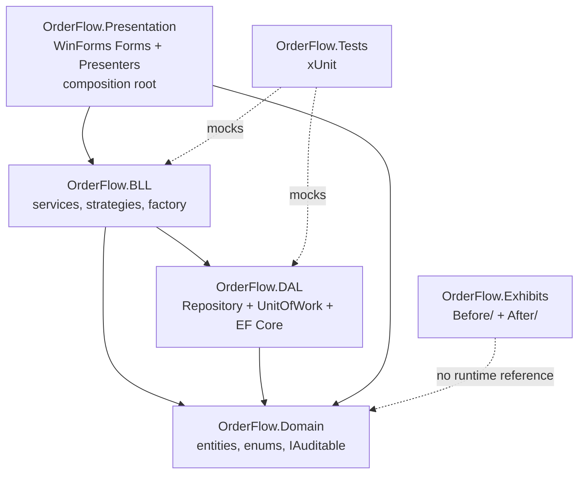
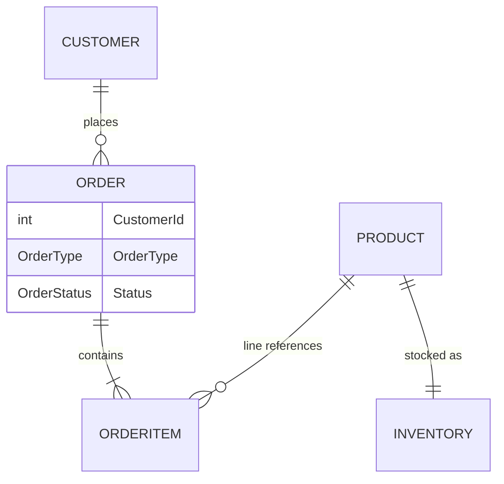

# Architecture Spine — OrderFlow Desktop

## Design Paradigm

Classic layered architecture: **Presentation → BLL → DAL**, all three depending on a shared **Domain** layer of entities/enums with no outward dependencies of its own. Each layer is a separate class library project; only `OrderFlow.Presentation` is executable. This is the brief's own framing (Presentation/BLL/DAL/cross-cutting) — not DDD, not CQRS — kept deliberately conventional so every layer boundary is a clean, defensible interview talking point.

## Invariants & Rules

### AD-1 — Strict layered dependency direction

- **Binds:** all
- **Prevents:** Presentation calling DAL directly, BLL depending on Presentation types, or any circular project reference.
- **Rule:** `OrderFlow.Presentation` references `OrderFlow.BLL` and `OrderFlow.Domain` only — and only for Domain enums/lightweight value types (e.g. `OrderType`, `OrderStatus`) used in UI binding; it never holds or passes EF-tracked Domain entities (see AD-12). `OrderFlow.BLL` references `OrderFlow.DAL` interfaces and `OrderFlow.Domain` only. `OrderFlow.DAL` references `OrderFlow.Domain` and EF Core only. `OrderFlow.Domain` has zero project references. No project may reference "up" the stack.
  - **Composition-root exception:** `OrderFlow.Presentation` additionally references `OrderFlow.DAL` solely for `Program.cs`'s composition root, which alone performs DI registration for every layer (including `AddPooledDbContextFactory<AppDbContext>`, per AD-2) and therefore must see every layer's types. This exception is scoped to `Program.cs`; no Form, Presenter, or any other Presentation type may reference `OrderFlow.DAL` or `AppDbContext` — those still call only `OrderFlow.BLL` interfaces, per AD-3.

### AD-2 — DbContext lifetime: per-operation via factory `[ADOPTED]`

- **Binds:** DAL, FR-11
- **Prevents:** A long-lived or shared `DbContext` causing stale tracked entities, change-tracker growth, or thread-safety violations across the WinForms process's lifetime; two `DbContext` instances silently participating in what must be one atomic operation.
- **Rule:** `AppDbContext` is resolved only through a singleton `IDbContextFactory<AppDbContext>`. **Only `IUnitOfWork` calls `CreateDbContextAsync()`** — once per business operation (per AD-5's definition), at construction. Repositories never call the factory themselves; each repository receives the ambient `DbContext` via a constructor parameter supplied by `IUnitOfWork` (see AD-9). Every repository used within one business operation therefore shares exactly one `DbContext` instance. No component holds a `DbContext` instance beyond one operation's scope.

### AD-3 — Presentation: constructor-injected Presenter + per-screen IView `[ADOPTED]`

- **Binds:** Presentation, FR-10
- **Prevents:** Validation, pricing, or workflow logic living in Form code-behind; Forms calling BLL services directly (bypassing the Presenter — the Rule cannot mechanically rule out inline arithmetic in a Form that never calls BLL at all, so this remains a review discipline, not just a compile-time guarantee); a blocked UI thread during a BLL call.
- **Rule:** Every Form implements a screen-specific `IXxxView` interface (e.g. `IOrderView`). A `XxxPresenter` class is constructor-injected with that `IView` and an `IServiceScopeFactory` (never long-lived BLL service instances) at Form-creation time. For each user-initiated action (button click, grid commit, etc. — one such action is exactly one "business operation" per AD-5), the Presenter opens one `IServiceScope`, resolves the BLL services it needs for that single operation, awaits them asynchronously (`async Task` throughout; the top-level UI event handler may be `async void` per WinForms convention, but nothing below it blocks with `.Result`/`.Wait()`), and disposes the scope when the operation completes — satisfying the PRD's UI-responsiveness NFR. Only the Presenter may call BLL services; the Form calls only its Presenter.
  - **Form-launching exception (added Story 1.3):** a Form that opens *other Forms* (e.g. `MainForm` opening `CustomerListForm`, `CustomerListForm` opening `CustomerDetailForm`) receives the root `IServiceProvider` via constructor injection, used solely to call `GetRequiredService<TForm>()` for that navigation. This is distinct from AD-5's "never resolved from a captured root provider" prohibition, which governs BLL/DAL service resolution — a Form is not a business operation, it is a business operation's UI container, and each launched Form still gets its own correctly-scoped `IServiceScopeFactory` for whatever its own Presenter does. A leaf Form that never launches another Form (e.g. `CustomerDetailForm`) does not receive `IServiceProvider`.
  - **Singleton-observer exception (added Story 3.4):** `MainForm` also constructor-injects `INotifier` directly, with no Presenter involved. `INotifier` is one of only two services registered Singleton (AD-5, alongside the not-yet-built `IAppSettings`), and `MainForm` only *observes* it — seeding from `GetLog()` and subscribing to `Notified` to passively render already-computed fields — it never calls a BLL method that performs validation, pricing, or workflow logic. This is narrower than the Form-launching exception above: it applies only to a Form rendering a cross-cutting Singleton's already-published data, never to calling a Scoped BLL service.

### AD-4 — OrderStatus transitions + notifications are BLL-orchestrated `[ADOPTED]`

- **Binds:** FR-8, FR-9, FR-15
- **Prevents:** Transition-validity logic duplicated or drifting between UI and BLL; notifications firing from inconsistent points; an `OrderType`-specific processor (AD-7) bypassing transition validity because the generic table has no compliant way to express its case.
- **Rule:** `OrderStatusService.TransitionTo(int orderId, OrderStatus newStatus)` is the sole owner of the allowed-transition table and the only caller of `INotifier.Notify(...)`; it raises the notification only after the Unit of Work confirms the status change persisted. The transition table is partitioned by the Order's `OrderType`, so `OrderType`-specific rules (e.g. a Rush order skipping a state a Standard order must pass through) are expressed as compliant entries in this one table — an `IOrderProcessor` (AD-7) requests a transition only by calling `TransitionTo`; it never evaluates transition validity itself. The notification payload is a dedicated `OrderStatusChangedNotification { int OrderId; OrderStatus OldStatus; OrderStatus NewStatus; }` DTO — carrying exactly this shape, no more — and `INotifier` is registered Singleton (UI-side subscribers must outlive any single Scoped operation). No other class evaluates transition validity or calls `INotifier`.

### AD-5 — DI lifetimes: scoped-per-operation, Singleton reserved for config `[ADOPTED]`

- **Binds:** all
- **Prevents:** Inconsistent service lifetimes causing shared mutable state across unrelated operations; Singleton misuse; two components disagreeing on how long a "business operation" lasts.
- **Rule:** A **business operation** is exactly one Presenter-method invocation triggered by one user-initiated action (a button click, grid commit, etc.) — never a whole Form session (see AD-3). Repositories, `IUnitOfWork`, and BLL services resolve as Scoped from an `IServiceScope` created per business operation and disposed at its end (WinForms has no ASP.NET-style per-request scope, so this scope is created explicitly by the Presenter at each operation's entry point). `IAppSettings` and `INotifier` (AD-4) are the only services registered Singleton; everything else scoped-per-operation is exactly that — never resolved from a captured root provider (see AD-7).

### AD-6 — Auditing via IAuditable, no soft-delete `[ADOPTED]`

- **Binds:** DAL, all Domain entities
- **Prevents:** Inconsistent or missing timestamp fields across entities; unneeded soft-delete/query-filter complexity in a domain that already models cancellation via `OrderStatus`; `CreatedAt` corruption from AD-2's disconnected-entity pattern (a DTO round-trip that doesn't carry the original `CreatedAt`).
- **Rule:** Every Domain entity implements `IAuditable` (`CreatedAt`, `UpdatedAt`). `AppDbContext` stamps `UpdatedAt` on every save and stamps `CreatedAt` **only** when the entity's `EntityState` is `Added`, in an overridden `SaveChanges`/`SaveChangesAsync` — it refuses to overwrite `CreatedAt` on any other state, regardless of what a repository's update call sends. Repositories update entities via targeted property changes (`Entry(entity).Property(x => ...).IsModified = true`), never a blanket `Update()` that marks a whole reconstructed-from-DTO graph `Modified`. No `IsDeleted` flag or global query filter exists.

### AD-7 — Order Processor Factory over keyed DI services `[ADOPTED]`

- **Binds:** FR-15
- **Prevents:** Ad hoc `switch`/`if` dispatch on `OrderType` scattered across BLL callers; a Singleton-registered factory capturing the root `IServiceProvider` and either throwing on scope validation or leaking a captive Scoped dependency.
- **Rule:** Each `IOrderProcessor` implementation registers via `AddKeyedScoped<IOrderProcessor>(OrderType, ...)`. `OrderProcessorFactory` itself is registered **Scoped** (never Singleton, despite the name) and is injected with the ambient scoped `IServiceProvider` for the current business operation (AD-5) — never a captured root provider or a Singleton-held `IServiceScopeFactory`. The only resolution path is `OrderProcessorFactory.Create(OrderType)`, which wraps `IServiceProvider.GetRequiredKeyedService`. No caller resolves `IOrderProcessor` directly.

### AD-8 — Before/After Exhibits isolated from the runtime DI graph `[ADOPTED]`

- **Binds:** FR-12
- **Prevents:** "Before" (SOLID-violating) exhibit code being wired into the running app or referenced by real BLL/DAL code; Before/After pairs each inventing their own vocabulary for the same domain concept.
- **Rule:** `OrderFlow.Exhibits` (with `Before/` and `After/` folders) is never referenced by `OrderFlow.Presentation`, `OrderFlow.BLL`, or `OrderFlow.DAL` — that is the only reference direction this AD forbids. `OrderFlow.Exhibits` **may** take a compile-time project reference to `OrderFlow.Domain`, and every exhibit pair must use real Domain types (e.g. `Order`) rather than a locally redefined toy type, so all exhibits share one vocabulary. It is opened and run independently for interview purposes only.

### AD-9 — Repository + Unit of Work is the only persistence boundary `[ADOPTED]`

- **Binds:** DAL, FR-11
- **Prevents:** BLL or Presentation issuing raw EF Core queries or touching `DbContext`/`DbSet<T>` directly; repositories each opening an independent `DbContext` instead of sharing the one `IUnitOfWork` owns (see AD-2).
- **Rule:** `DbContext` and `DbSet<T>` types are internal to `OrderFlow.DAL`, with one exception: `AppDbContext` itself is `public` solely because `OrderFlow.Presentation`'s composition root (`Program.cs`, per the AD-1 composition-root exception) must name it to call `AddPooledDbContextFactory<AppDbContext>(...)`. `DbSet<T>` types remain fully internal — nothing outside `OrderFlow.DAL` ever sees or declares one. `IUnitOfWork` is constructed with the operation's single `DbContext` (per AD-2) and exposes repository properties (e.g. `IUnitOfWork.Orders`, `.Customers`, `.Inventory`) backed by that same instance — repositories are never independently DI-registered or constructor-injected into BLL services alongside `IUnitOfWork`. `OrderFlow.BLL` depends only on `IUnitOfWork` (through which it reaches `I*Repository` members) and `I*Repository` interface types — never on EF Core types directly.
  - **Concurrency-exception exception (added Story 1.4):** `OrderFlow.BLL` may additionally depend on plain, DAL-defined exception types (e.g. `ConcurrencyConflictException`) that wrap an EF Core exception without exposing any EF Core type in their own public shape. `UnitOfWork.SaveChangesAsync()` is the sole place that catches the real EF Core exception (`DbUpdateConcurrencyException`, per AD-10) and rethrows the plain wrapper; BLL services catch only the wrapper, never the EF Core type itself. This does not reopen "never on EF Core types directly" — it's the mechanism that keeps it true while still letting AD-10's required translation happen.

### AD-10 — Optimistic concurrency via RowVersion token

- **Binds:** DAL, all Domain entities, FR-5
- **Prevents:** Two near-simultaneous confirmations against the same Product's stock (or any entity) silently overwriting each other — the scenario "basic optimistic concurrency" (PRD §5 Non-Goals) names explicitly.
- **Rule:** Every Domain entity carries a `RowVersion` (`byte[]`, EF Core `[Timestamp]`/`IsRowVersion()`) concurrency token. Repository `Update`/`SaveChanges` calls that hit a `DbUpdateConcurrencyException` translate it into a `Result<T>` failure (per the Validation & error handling convention) — never an unhandled exception reaching Presentation. Which entities most need this (Inventory is the obvious first case, per FR-5) is an Epics-level prioritization call; the token and translation convention itself is fixed here for all entities.

### AD-11 — Pricing/Discount Strategy: single composition-root registration

- **Binds:** FR-7
- **Prevents:** One story building a keyed-DI dispatch mechanism for `IPricingStrategy` mirroring AD-7 (on the unstated assumption pricing varies per-Order like `OrderType` does) while another assumes a single swappable registration — two incompatible wiring shapes for the same interface.
- **Rule:** Exactly one `IPricingStrategy` implementation is registered Scoped at the composition root at a time (`services.AddScoped<IPricingStrategy, ConcreteStrategy>()`). Swapping the active strategy means changing that one registration line — no keyed dispatch, no runtime selection per-Order. If a future requirement needs pricing to vary per-Order the way `OrderType` does, that is a new AD, not a silent reinterpretation of this one.

### AD-12 — Domain entities never cross the BLL→Presentation boundary

- **Binds:** all
- **Prevents:** A BLL method returning/accepting a raw EF-tracked Domain entity that Presentation then holds past its originating operation's scope (AD-2), silently defeating per-operation `DbContext` isolation with a stale, detached entity.
- **Rule:** Every BLL service method called from Presentation accepts and returns `XxxDto` types only (per the Naming convention). Mapping between Domain entity and DTO happens entirely inside BLL. Presentation may reference `OrderFlow.Domain` only for enums/lightweight value types used in UI binding (AD-1) — never for entity instances.

### AD-13 — InventoryService is the sole owner of stock-sufficiency checks

- **Binds:** FR-3, FR-5, FR-6
- **Prevents:** Order creation (FR-3) and Inventory decrement (FR-5) independently reimplementing "is there enough stock" and drifting — one checking `>=`, the other `>`, or checking against different fields.
- **Rule:** `IInventoryService.HasSufficientStock(...)` is the only method that evaluates stock sufficiency. `OrderService` calls it during order confirmation (FR-3's validation) rather than querying `IInventoryRepository` directly; the same check is reused, not reimplemented, when FR-5 performs the actual decrement within the same business operation.



## Consistency Conventions

| Concern | Convention |
| --- | --- |
| Naming (entities, files, interfaces, events) | Interfaces `IXxx`; repositories `IXxxRepository`/`XxxRepository`; services `IXxxService`/`XxxService`; presenters `XxxPresenter`; views `IXxxView`; DTOs `XxxDto`; EF configs `XxxConfiguration : IEntityTypeConfiguration<Xxx>`. |
| Data & formats (ids, dates, money) | Ids: `int` identity (EF Core default). Dates: stored/passed as UTC `DateTime`, converted to local only at the Presentation layer for display. Money: `decimal`, never `float`/`double`. |
| Validation & error handling | BLL methods that can fail validation return a `Result<T>` (success/failure + message) — not exceptions. Exceptions are reserved for infrastructure failures (DB unavailable, etc.), never for expected validation outcomes like "insufficient inventory." |
| UI error surfacing | Infrastructure exceptions (not `Result<T>` failures — those render inline per-screen via the Presenter) surface through one global handler wired at the composition root (`Application.ThreadException` / `AppDomain.UnhandledException`), not per-Presenter try/catch. |
| Logging | `Microsoft.Extensions.Logging` with `ILogger<T>` constructor-injected wherever a class needs to log; no static loggers. |

## Stack

<!-- SEED — verified web-current 2026-08-06; code owns exact pins once it exists. -->

**Intentional override of source input:** the brief/addendum explicitly locked .NET 8. This spine binds .NET 10 instead — .NET 8 reaches end-of-support 2026-11-10 (~3 months from this spine's authoring date), while .NET 10 is the current LTS (released 2025-11-11, supported through 2028-11) and is a drop-in target for the same WinForms/EF Core/DI stack. Surfaced to and confirmed by the user before binding (see memlog); the brief's underlying framework/library choices (WinForms, EF Core, `Microsoft.Extensions.DependencyInjection`) are unchanged, only the pinned major version moved.

| Name | Version |
| --- | --- |
| .NET | 10 (LTS, supported through 2028-11) — overrides brief's .NET 8 pin, see note above |
| WinForms | .NET 10 SDK (`Microsoft.NET.Sdk.WindowsDesktop`) |
| Microsoft.EntityFrameworkCore / .SqlServer | 10.0.x (latest verified: 10.0.9–10.0.10; code pins whatever's current at scaffold time) |
| Microsoft.Extensions.DependencyInjection | ships with .NET 10 SDK; keyed-services API stable since .NET 8 |
| xunit.v3 | 3.2.2 |
| SQL Server LocalDB | bundled with Visual Studio |

## Structural Seed



```text
OrderFlow/
  OrderFlow.Presentation/   # WinForms Forms + IView interfaces + Presenters; Program.cs composition root
  OrderFlow.BLL/             # IXxxService + implementations, OrderStatusService, IPricingStrategy impls, OrderProcessorFactory
  OrderFlow.DAL/              # AppDbContext, EF entity configs, Repository + UnitOfWork implementations
  OrderFlow.Domain/           # entities, OrderType/OrderStatus enums, IAuditable
  OrderFlow.Exhibits/          # Before/ and After/ SOLID exhibit pairs — standalone, no runtime reference (AD-8)
  OrderFlow.Tests/              # xUnit; mocks BLL/DAL interfaces (FR-14)
  OrderFlow.Presentation.Tests/  # xUnit; Presenter tests only — added Story 1.3, see note below
  docs/
    interview-topic-map.md        # FR-13
```

**`OrderFlow.Presentation.Tests` — added during Story 1.3, amending this seed's original six-project count.** `OrderFlow.Presentation` targets `net10.0-windows` (WinForms); a `net10.0` test project cannot even restore a `ProjectReference` to it (`NU1201`), and retargeting `OrderFlow.Tests` itself to `net10.0-windows` would stop its test host from launching on any machine lacking the `Microsoft.WindowsDesktop.App` runtime — breaking every existing BLL/DAL test's ability to run locally on non-Windows dev machines, not just the new Presenter tests. `OrderFlow.Presentation.Tests` isolates that constraint: it targets `net10.0-windows` (with `EnableWindowsTargeting`), references `OrderFlow.Presentation` to test Presenters via mocked `IView`/`IServiceScopeFactory`, and builds everywhere but only *runs* on Windows/CI. `OrderFlow.Tests` is unaffected and keeps testing BLL/DAL on any platform.

## Capability → Architecture Map

| Capability / Area | Lives in | Governed by |
| --- | --- | --- |
| FR-1, FR-2 — Customer/Product management | Presentation, BLL, DAL | AD-1, AD-3, AD-9, AD-12 |
| FR-3, FR-4 — Order entry & detail | Presentation, BLL | AD-2, AD-3, AD-9, AD-12, AD-13 |
| FR-5, FR-6 — Inventory & availability | BLL, DAL | AD-2, AD-9, AD-10, AD-13, Validation convention |
| FR-7 — Pricing/Discount Strategy | BLL | AD-1, AD-5, AD-11 |
| FR-8, FR-9 — Status workflow & notifications | BLL | AD-4 |
| FR-10, FR-11 — DI foundation, Repository + UoW | all | AD-1, AD-2, AD-5, AD-9 |
| FR-12 — Before/After Exhibits | OrderFlow.Exhibits | AD-8 |
| FR-13 — Interview Topic Map | docs/ | n/a (documentation artifact) |
| FR-14 — Companion test project | OrderFlow.Tests | AD-2, AD-5, AD-9 (mockability) |
| FR-15 — Order Processor Factory | BLL | AD-4, AD-7 |

## Deferred

- ~~**Concrete discount rule(s)** (PRD §8 Q1) — Epics/Stories choose the actual `IPricingStrategy` implementations; AD-11 fixes how the single implementation is wired/swapped.~~ **Resolved in Story 2.2:** `StandardPricingStrategy` (sums `Quantity × UnitPriceAtOrder`, no discount) is the sole implementation, registered per AD-11.
- **Full OrderStatus sequence, incl. exact Cancelled reachability, per OrderType** (PRD §8 Q2) — Epics fills `OrderStatusService`'s `OrderType`-partitioned transition table within AD-4's contract.
- **Notification surface** — in-app log, toast, or both (PRD §8 Q3) — a UX/Epics decision about the `INotifier` consumer; the notification's payload shape and lifetime are already fixed by AD-4, so this only decides how a subscriber renders it.
- **Standard vs. Rush exact behavioral difference** (PRD §8 Q5) — Epics defines `StandardOrderProcessor`/`RushOrderProcessor` content within AD-7's factory contract and AD-4's OrderType-partitioned transition table.
- **Domain-too-thin contingency** — Chain of Responsibility / Adapter fallback (PRD §8 Q6) — revisit only if triggered; would add a new AD, not retrofit existing ones.
- **Exact EF Core relationship cardinalities/FKs beyond the ERD sketch** — Epics/Dev finalize within the ERD's shape (addendum item 6a).
- **Deployment & environments beyond LocalDB dev-machine** — out of scope by design: PRD Non-Goals explicitly exclude deployment/installer packaging and any hosting topology. No CI/CD or server environment is needed at this altitude.
- **UI-polish-vs-BLL/DAL effort allocation** — the addendum's guidance that UI polish shouldn't crowd out BLL/DAL/pattern work is a project-management guardrail for Epics prioritization, not an architectural invariant; carried forward here so it isn't silently lost.
